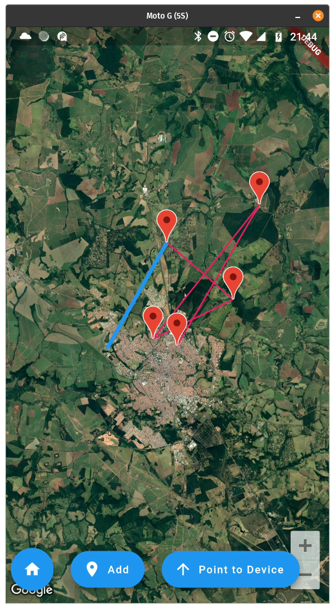
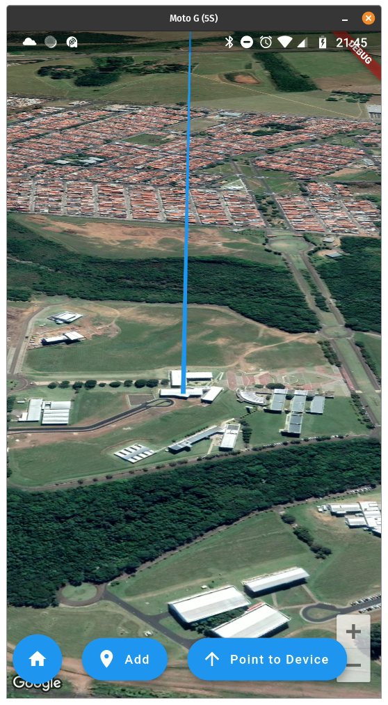

# firstattemptatmaps

Parte do mapa

## Features
Gera posições aleatorias em sao carlos, simulando a sonda. Faz uma animaçãozinha apontando a camera para a última localização

## Note
Precisa da API do google maps em `android/app/src/main/AndroidManifest.xml`

Reacts to the following events:

    - New device position (lat, lng, alt, speed)
    - New user position (lat, lng)

Displays the following information:
    - User's current location
    - Target's path
    

